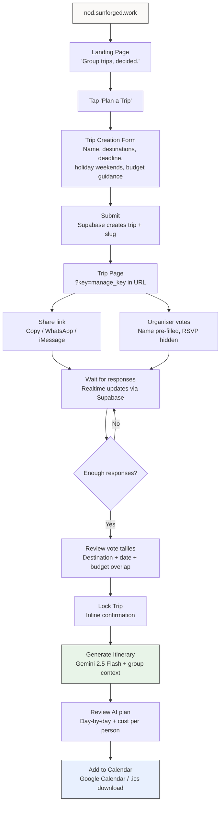
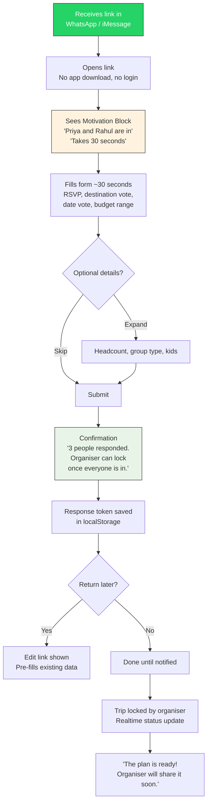
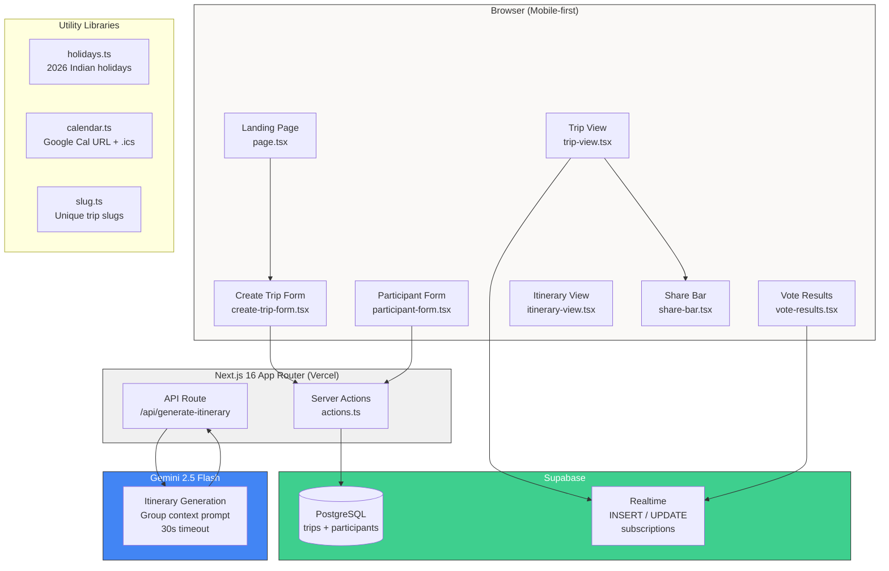
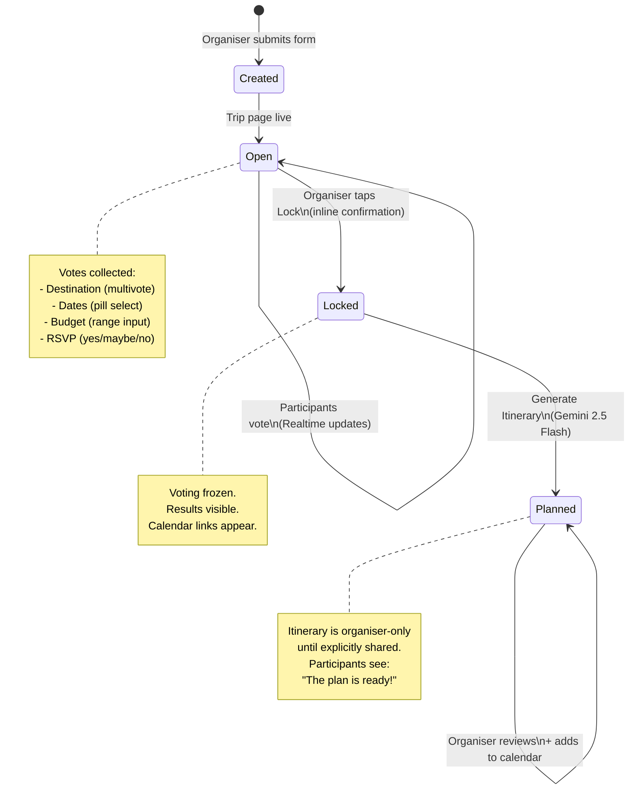
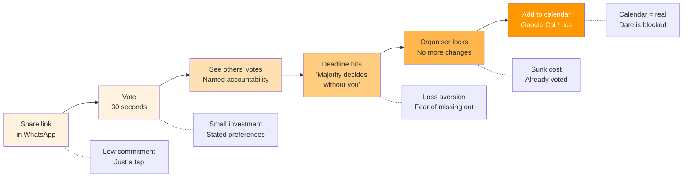
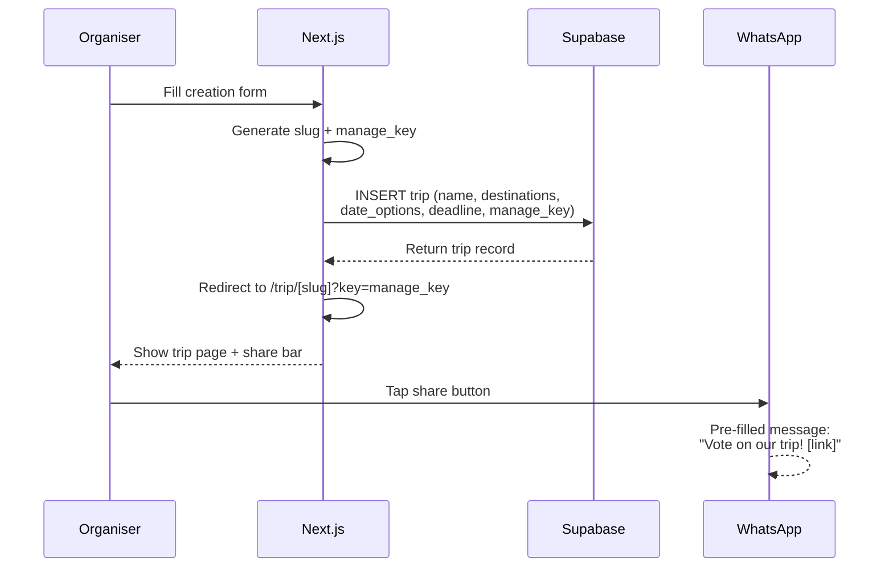
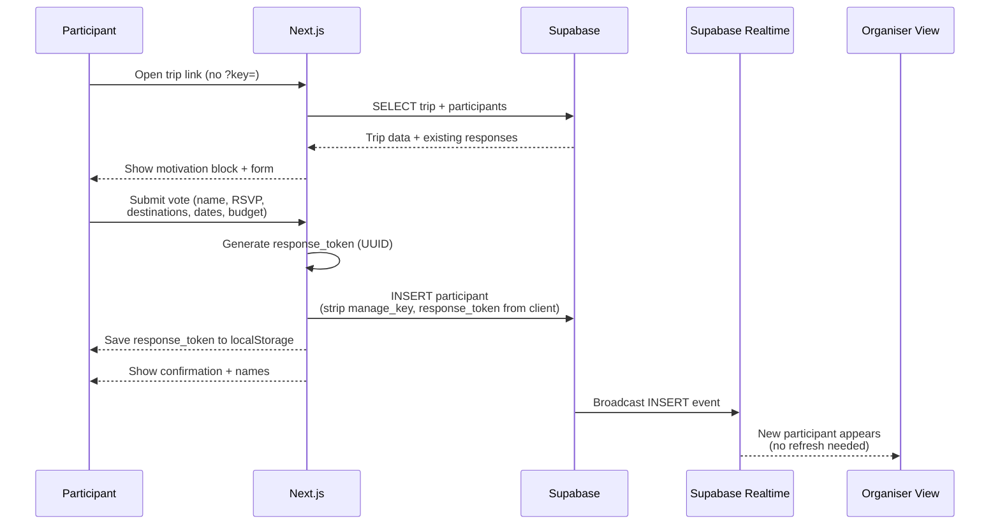

# Nod PRD - Mermaid Diagrams

Paste each diagram into https://mermaid.live to render as PNG for Google Docs.

---

## 1. Organiser Flow (First-Time User)

---

## 2. Participant Flow (First-Time User)

---

## 3. System Architecture

---

## 4. Trip Lifecycle (State Machine)

---

## 5. Commitment Ratchet

---

## 6. Data Flow: Organiser Creates Trip

---

## 7. Data Flow: Participant Responds

